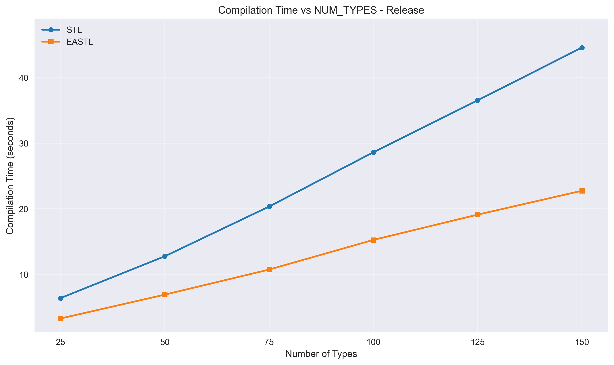

# STL vs EASTL Compilation Time Benchmark

This project compares compilation times and binary sizes between the Standard Template Library (STL) and Electronic Arts Standard Template Library (EASTL).

## Benchmark Methodology

The benchmark instantiates multiple container types with different test types to measure real-world template instantiation overhead.

Benchmark setup Macbook M4 MAX.

## Results Summary

### Compilation Time and Binary Size (100 types)

| Build Type | Library | Compilation Time (s) | Binary Size (KB) | Time Ratio | Size Ratio |
|------------|---------|---------------------|------------------|------------|------------|
| Debug | STL | 18.69 ± 0.24 | 33,755 | - | - |
| Debug | EASTL | 5.37 ± 0.05 | 15,427 | **3.48x faster** | **2.19x smaller** |
| Release | STL | 28.88 ± 0.23 | 1,768 | - | - |
| Release | EASTL | 15.27 ± 0.07 | 1,600 | **1.89x faster** | **1.11x smaller** |

📊 **Detailed Results:**
- [Debug Build Results](benchresults/Mac_M4Max/compilation_time_comparison_100_types_debug.txt)
- [Release Build Results](benchresults/Mac_M4Max/compilation_time_comparison_100_types_release.txt)

#### Compilation Time Comparison Charts

**Debug Build (100 types):**

**Release Build (100 types):**

### Scalability Analysis

The benchmark tested different numbers of types (25, 50, 75, 100, 125, 150):

| Types | Debug STL (s) | Debug EASTL (s) | Ratio | Release STL (s) | Release EASTL (s) | Ratio |
|-------|---------------|-----------------|-------|-----------------|-------------------|-------|
| 25 | 4.39 | 1.44 | 3.05x | 6.39 | 3.29 | 1.95x |
| 50 | 8.74 | 2.68 | 3.26x | 12.77 | 6.92 | 1.84x |
| 75 | 13.49 | 4.00 | 3.37x | 20.34 | 10.74 | 1.89x |
| 100 | 18.52 | 5.25 | 3.53x | 28.61 | 15.26 | 1.88x |
| 125 | 23.70 | 6.71 | 3.53x | 36.52 | 19.11 | 1.91x |
| 150 | 29.70 | 7.94 | 3.74x | 44.56 | 22.75 | 1.96x |

**Key Findings:**
- STL compilation time grows linearly: ~0.19s per type (Debug), ~0.29s per type (Release)
- EASTL compilation time grows linearly: ~0.05s per type (Debug), ~0.15s per type (Release)

📊 **Scalability Results:**
- [Debug Scalability Data](benchresults/Mac_M4Max/num_types_comparison_debug.txt)
- [Release Scalability Data](benchresults/Mac_M4Max/num_types_comparison_release.txt)

#### Scalability Charts

**Debug Mode Scaling:**

**Release Mode Scaling:**

## Detailed Analysis

### Frontend vs Backend Compilation

Clang build analysis reveals where time is spent:

| Phase | STL Debug | EASTL Debug | STL Release | EASTL Release |
|-------|-----------|-------------|-------------|---------------|
| Frontend (parsing) | 12.0s | 2.9s | 8.1s | 1.8s |
| Backend (codegen) | 6.9s | 2.5s | 23.3s | 13.8s |
| Template instantiation | 5.92s | 1.28s | 5.99s | 1.16s |
| Header parsing | 0.18s | 0.12s | 0.19s | 0.11s |

🔍 **Detailed Clang Analysis:**
- [STL Debug Analysis](benchresults/Mac_M4Max/clang_analysis_stl_compilation_benchmark_test_Debug.txt)
- [EASTL Debug Analysis](benchresults/Mac_M4Max/clang_analysis_eastl_compilation_benchmark_test_Debug.txt)
- [STL Release Analysis](benchresults/Mac_M4Max/clang_analysis_stl_compilation_benchmark_test_Release.txt)
- [EASTL Release Analysis](benchresults/Mac_M4Max/clang_analysis_eastl_compilation_benchmark_test_Release.txt)
